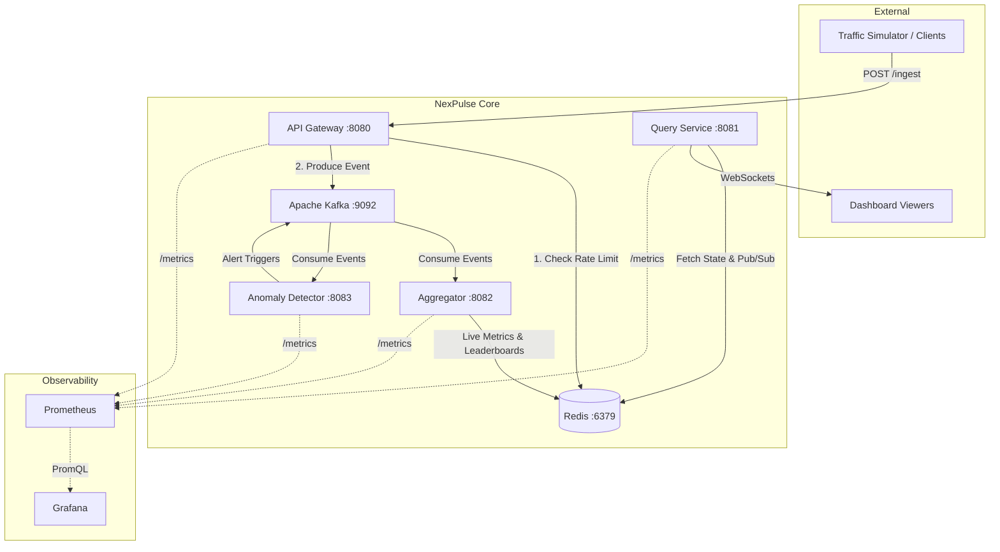
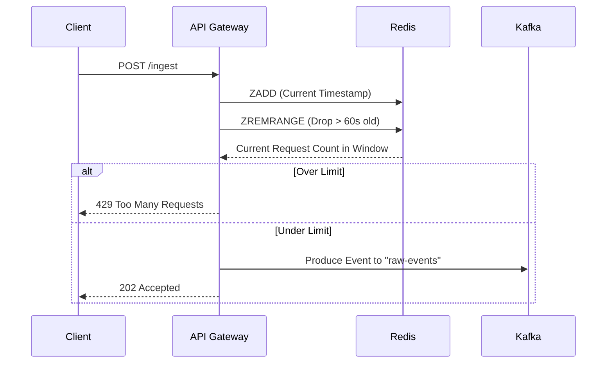

  
# 🚀 NexPulse

**A blazingly fast, distributed real-time event analytics engine.**

 

NexPulse is a **production-grade, distributed real-time event analytics engine**. Built entirely in Go, it is designed to ingest massive volumes of arbitrary events (100,000+ events/sec), process them through a fault-tolerant Kafka pipeline, compute sub-millisecond aggregations using Redis, and expose deep system observability through Prometheus and Grafana.

---

## 📁 Project Structure & Organization

NexPulse is highly modular, with concerns cleanly separated across specialized microservices.

| Directory | Core Task & Responsibility |
|-----------|----------------------------|
| `services/gateway/` | The ingestion front-door (`POST /ingest`). Validates payloads, executes strict Redis sliding-window rate limiting, and queues events into Kafka. |
| `services/aggregator/` | The high-speed analytics engine. Consumes Kafka streams and writes optimized aggregations (HyperLogLog, Sorted Sets) into Redis. |
| `services/anomaly/` | A specialized background worker that monitors the event stream for statistical traffic spikes using Exponential Moving Averages (EMA). |
| `services/query/` | Isolates read traffic. Maintains WebSocket connections and REST APIs to push live data to clients without straining the Aggregator. |
| `tools/simulator/` | A heavy-duty traffic generator capable of blasting the Gateway with up to 100,000 events/sec to stress-test the architecture. |
| `infra/` | Contains the `docker-compose.yml` and configurations for spinning up Kafka, Zookeeper, Redis, Prometheus, and Grafana. |
| `infra/grafana/` | Stores the automated JSON provisioning scripts for our 6 highly-customized, real-time monitoring dashboards. |

---

## 🏗️ System Architecture

To achieve massive scale without data loss, NexPulse relies on a strictly decoupled, event-driven architecture. 

---

## 🔄 Data Flow & Rate Limiting

NexPulse avoids traditional SQL databases entirely to prevent write-locking bottlenecks. Instead, it relies on highly specific Redis algorithms.

### Sliding Window Rate Limiting
To prevent API abuse, the Gateway enforces a strict rate limit. Instead of a simple "token bucket" that can allow sudden bursts, we use a precise **Sliding Window** in Redis via Sorted Sets (`ZSET`).

### Constant-Memory Unique Counting
Once events hit Kafka, the **Aggregator** consumes them and updates Redis in real-time.
- **Unique Users:** We do not store every User ID to run an expensive `COUNT DISTINCT`. Instead, we use Redis **HyperLogLog** (`PFADD`). This allows us to estimate the exact number of unique visitors using a maximum of **12 KB of memory**, regardless of whether there are 1,000 or 1,000,000 visitors.
- **Leaderboards:** We track the most hit endpoints and top countries dynamically using Redis **Sorted Sets** (`ZINCRBY`). Fetching the top 10 is an $O(\log N)$ operation, guaranteeing sub-millisecond dashboard updates.

---

## 🚀 Quick Start

NexPulse is incredibly easy to run locally. You only need **Docker** and **Go 1.22+**.

### 1. Launch the Infrastructure
| Command | Action |
|---------|--------|
| `docker-compose -f infra/docker-compose.yml up -d` | Starts all Docker containers. |
| `docker-compose -f infra/docker-compose.yml down` | Stops all containers. |
| `docker-compose -f infra/docker-compose.yml down -v` | Wipes all data and resets the environment. |

### 2. Start the Microservices
Open **4 separate terminal windows** and run one of these commands in each:

| Command | Service | Description |
|---------|---------|-------------|
| `cd services/gateway && go run .` | **Gateway** | Starts the ingestion API on `:8080`. |
| `cd services/aggregator && go run .`| **Aggregator** | Consumes Kafka and computes live Redis metrics. |
| `cd services/anomaly && go run .` | **Detector** | Hunts for statistical traffic spikes. |
| `cd services/query && go run .` | **Query API** | Exposes WebSockets and REST APIs. |

### 3. Unleash the Traffic Simulator
Open one final terminal to generate synthetic traffic and watch the dashboards come alive!

| Command | Load Level |
|---------|------------|
| `cd tools/simulator && go run . --rate 1000 --workers 20` | Normal traffic (~1,000 requests/sec). |
| `cd tools/simulator && go run . --rate 10000 --workers 100` | Heavy traffic (~10,000 requests/sec). |
| `cd tools/simulator && go run . --rate 50000 --workers 500` | **MAX POWER** (~50,000+ requests/sec). |

---

## 📊 God-Mode Observability

Observability is a first-class citizen in NexPulse. Every microservice automatically exposes a Prometheus `/metrics` endpoint out of the box. 

When you run `make up`, Grafana is automatically provisioned with 6 breathtaking, real-time dashboards to track everything from Kafka consumer lag down to Go garbage collection pauses.

- **URL:** [http://localhost:3000](http://localhost:3000)
- **Username:** `admin`
- **Password:** `nexpulse`

---

## 🛠️ Commands Reference

| Command | Description |
|---------|-------------|
| `make up` | Starts all Docker infrastructure. |
| `make down` | Gracefully stops all containers. |
| `make clean` | Wipes all data volumes for a fresh reset. |
| `make check` | Runs an automated health check against all API and infra endpoints. |
| `make build` | Compiles all Go binaries into the `./bin/` directory. |
